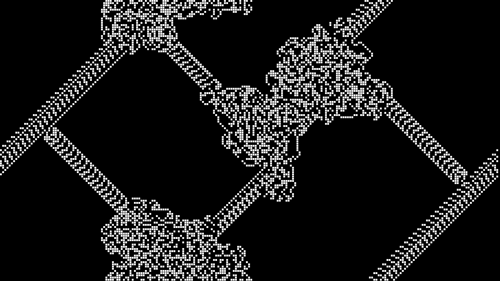

# Langton's Ant
Langton's Ant is a very simple cellular automaton with just two rules that you can code in 30 minutes.

1. The ant is placed on a grid of cells, where each cell is either white or black.
2. The ant moves according to the color of the cell it is currently on:
    - If the cell is white, the ant turns 90° right, flips the color of the cell to black, and moves forward one unit.
    - If the cell is black, the ant turns 90° left, flips the color of the cell to white, and moves forward one unit.

You can read more here: https://en.wikipedia.org/wiki/Langton%27s_ant

